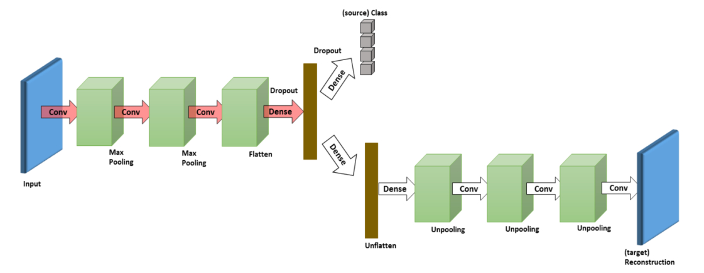

## This is a pytorch implementation of the model [Deep Reconstruction-Classification Network for Unsupervised Domain Adapation (DRCN)](https://arxiv.org/abs/1607.03516).

## Structure

## Usage

- put the mnist and svhn data in the entries in `dataset`, respectively
- if there is no Grayscale transform in your torchvision, please replace your `functional.py` and `transforms.py`
with provided files in `extra`
- run `python main.py` for training
- the trained model will be saved in `model`, and recontructed images saved in `recovery_image`
- In our implementation, no denoising include